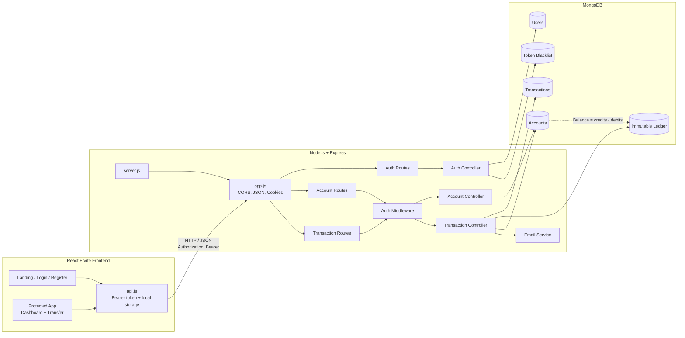
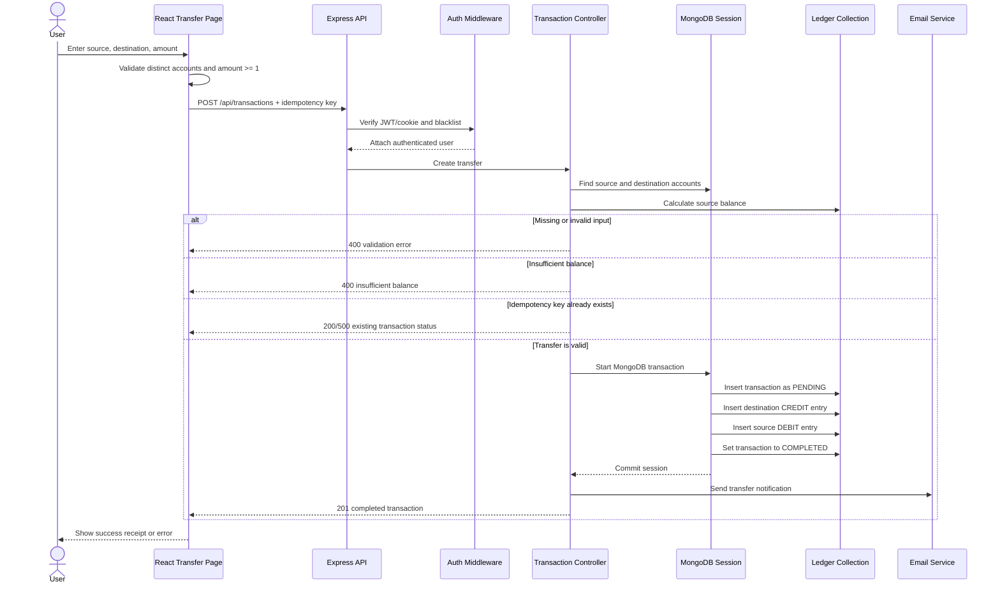
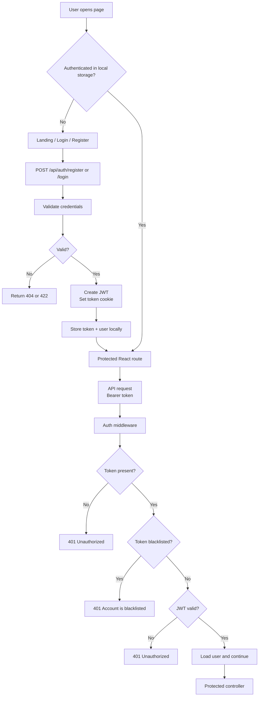

# Bank Ledger Architecture

## System Architecture

```mermaid
flowchart LR
    subgraph Client["React + Vite Frontend"]
        UI["Landing / Login / Register"]
        CLIENT_APP["Protected App<br/>Dashboard + Transfer"]
        API_CLIENT["api.js<br/>Bearer token + local storage"]
    end

    subgraph Server["Node.js + Express"]
        ENTRY["server.js"]
        SERVER_APP["app.js<br/>CORS, JSON, Cookies"]
        AUTH["Auth Routes"]
        ACCOUNT["Account Routes"]
        TX["Transaction Routes"]
        AM["Auth Middleware"]
        AC["Auth Controller"]
        ACC["Account Controller"]
        TC["Transaction Controller"]
        EMAIL["Email Service"]
    end

    subgraph Data["MongoDB"]
        USERS[("Users")]
        ACCOUNTS[("Accounts")]
        TXN[("Transactions")]
        LEDGER[("Immutable Ledger")]
        BLACKLIST[("Token Blacklist")]
    end

    UI --> API_CLIENT
    CLIENT_APP --> API_CLIENT
    API_CLIENT -->|"HTTP / JSON<br/>Authorization: Bearer"| SERVER_APP

    ENTRY --> SERVER_APP
    SERVER_APP --> AUTH
    SERVER_APP --> ACCOUNT
    SERVER_APP --> TX

    AUTH --> AC
    ACCOUNT --> AM --> ACC
    TX --> AM --> TC

    AC --> USERS
    AC --> BLACKLIST
    ACC --> ACCOUNTS
    TC --> TXN
    TC --> LEDGER
    TC --> ACCOUNTS
    TC --> EMAIL

    ACCOUNTS -.->|"Balance = credits - debits"| LEDGER
```

## Transfer Flow

```mermaid
sequenceDiagram
    actor User
    participant UI as React Transfer Page
    participant API as Express API
    participant Auth as Auth Middleware
    participant Tx as Transaction Controller
    participant DB as MongoDB Session
    participant Ledger as Ledger Collection
    participant Email as Email Service

    User->>UI: Enter source, destination, amount
    UI->>UI: Validate distinct accounts and amount >= 1
    UI->>API: POST /api/transactions + idempotency key
    API->>Auth: Verify JWT/cookie and blacklist
    Auth-->>API: Attach authenticated user

    API->>Tx: Create transfer
    Tx->>DB: Find source and destination accounts
    Tx->>Ledger: Calculate source balance

    alt Missing or invalid input
        Tx-->>UI: 400 validation error
    else Insufficient balance
        Tx-->>UI: 400 insufficient balance
    else Idempotency key already exists
        Tx-->>UI: 200/500 existing transaction status
    else Transfer is valid
        Tx->>DB: Start MongoDB transaction
        DB->>Ledger: Insert transaction as PENDING
        DB->>Ledger: Insert destination CREDIT entry
        DB->>Ledger: Insert source DEBIT entry
        DB->>Ledger: Set transaction to COMPLETED
        DB-->>Tx: Commit session
        Tx->>Email: Send transfer notification
        Tx-->>UI: 201 completed transaction
    end

    UI-->>User: Show success receipt or error
```

## Authentication and Protected Request Flow

```mermaid
flowchart TD
    A["User opens page"] --> B{"Authenticated in local storage?"}
    B -- "No" --> C["Landing / Login / Register"]
    C --> D["POST /api/auth/register or /login"]
    D --> E["Validate credentials"]
    E --> F{"Valid?"}
    F -- "No" --> G["Return 404 or 422"]
    F -- "Yes" --> H["Create JWT<br/>Set token cookie"]
    H --> I["Store token + user locally"]
    B -- "Yes" --> J["Protected React route"]
    I --> J

    J --> K["API request<br/>Bearer token"]
    K --> L["Auth middleware"]
    L --> M{"Token present?"}
    M -- "No" --> N["401 Unauthorized"]
    M -- "Yes" --> O{"Token blacklisted?"}
    O -- "Yes" --> P["401 Account is blacklisted"]
    O -- "No" --> Q{"JWT valid?"}
    Q -- "No" --> R["401 Unauthorized"]
    Q -- "Yes" --> S["Load user and continue"]

    S --> T["Protected controller"]
```
